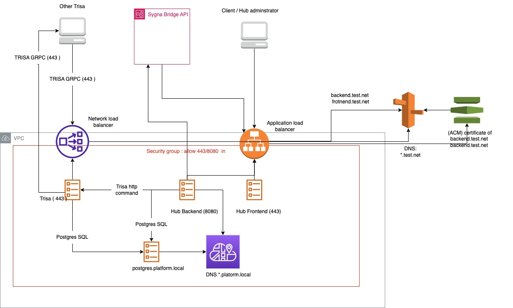

# Sygna Hub Document 




### How to launch Hub service in AWS


1. Make sure the domain of you service and get the issued cert(s) [ACM](https://docs.aws.amazon.com/acm/index.html) for the domain. 

2. install docker engine and docker-compose
* [Docker](https://docs.docker.com/engine/install/#server)
* [Docker Compose](https://docs.docker.com/compose/install/)

3. download [docker-compose.yml](docker-compose.yml) [docker-compose.aws.override.yml](docker-compose.aws.override.yml) to your `./platform` , and customized `docker-compose.aws.override.yml` to fit your needs. If you changed the folder of files , you have to update settings `docker-compose.aws.override.yml` services:backend:environment:DB_HOST to match the auto generated private dns record ( `postgres.{folder_name}.local`).

4. Create and switch into  AWS context with docker cli (https://docs.docker.com/cloud/ecs-integration/) 

5. execute below command to launch containers in ECS
    ```
    docker-compose  -f docker-compose.yml  -f docker-compose.aws.override.yml up
    ```
6. login into AWS and get the DNS name ( like sygna-hub-XXXXX.ap-northeast-1.elb.amazonaws.com ) of ALB created 

7. Update DNS record to point the frontend / backend location into ALB DNS name in step 6.


### How to add trisa gateway service to Hub service in AWS
#### These steps counld not be done by docker-compsoe up since Trisa gateway have to use different load balancer and open multi ports.

1. Finish previous section to start hub on aws

2. Get the IAM role arn of backend service ( like arn:aws:iam::654655157226:role/platform-BackendTaskExecutionRole-XXXXX ) created by docker-compose in AWS IAM

3. Update [trisa.aws.taskdefinition.json](trisa.aws.taskdefinition.json) with IAM role arn from previous step and other parameters reference to updated [docker-compose.aws.override.yml](docker-compose.aws.override.yml), the strings need to be changed would be
    - <DATA_ENCRYPTION_KEY> ( same with docker-compose.aws.override.yml )
    - <POSTGRES_USER> ( same with docker-compose.aws.override.yml )
    - <POSTGRES_PASSWORD> ( same with docker-compose.aws.override.yml )
    - <IAM_ROLE_ARN_OF_PLATFORM_BACKEND>  ( get the IAM role ARN from step 1 )

4. Register a new ECS tas definition on [AWS-ECS Task definition](https://ap-northeast-1.console.aws.amazon.com/ecs/home?region=ap-northeast-1#/taskDefinitions) with updated [trisa.aws.taskdefinition.json](trisa.aws.taskdefinition.json) in step 2.

5. Create a AWS Network Load Balancer to receive incoming tcp traffic going into trisa in [AWS EC2 console](https://ap-northeast-1.console.aws.amazon.com/ec2/home?region=ap-northeast-1#LoadBalancers:sort=loadBalancerName)
    1. The parameters to be setting in Configure Load Balancer :
        - name : hub-trisa
        - Scheme : internet-facing
        - IP address type : ipv4
        - Load Balancer Protocol : TCP
        - Load Balancer Port : 443
        - VPC : same as hub settings , suppose to be default VPC and Availability Zones
    
    2. Ignore the Waring message of 'Improve your load balancer’s security. Your load balancer is not using any secure listener.' and click Next: Configure Routing
    
    3. The parameters to be setting in Configure Routing :
        - Target group : New Target group
        - Name : hub-trisa
        - Target type : IP
        - Protocol : TCP
        - Pport : 443

    4. Ignore the Step 4: Register Targets and Create the Network Load Balancer and Target group 
    5. (Optional) Change your DNS record of Trisa endpoint to point into this Network Load Balancer.

6. Create Task service
    1. Head into [ECS service console] (https://ap-northeast-1.console.aws.amazon.com/ecs/home?region=ap-northeast-1#/clusters/platform/services) created by previous Phase.
    2. Turn off "New ECS Experience" since we need service discover utilits which is not support yet.
    3. Finish Step 1. Configure service with following parameters
        - Launch type : fargate
        - Operating system family : Linux
        - Task Definition : platform-trisa ( created by step 4.)
        - Revision : 1
        - Platform version : Latest
        - Cluster : platform
        - Service name : trisa 
        - Number of tasks: 1
        - Minimum healthy percent : 100
        - Maximum percent : 200
        - Deployment circuit breaker : Disabled
        - Deployment type : Rolling Updated 
    
    4. Finish Step 2. Configure network with following parameters
        - Cluster VPC : Same as hub backend service , supporse to be default VPC.
        - Subnets : Same as hub backend service
        - Security groups :  Same as hub backend service 
        - Auto-assign public IP : Enabled
        - Load balancer type : Network Load Balancer
        - Load balancer name : hub-trisa
        - Container name : port : trisa:443:443
        - Enable service discovery integration : checked , and following parameters will be popout.
        - Namespace: platform.local|PRIVATE
        - Configure service discovery service:Create new service discovery service
        - Service discovery name : trisa
        - Enable ECS task health propagation: checked
        - DNS record type : A
        - TTL : 60
    5. Ignore Step 3: Set Auto Scaling (optional) and Step 4: Review to Create the service.

    6. After the Status of trisa become  "ACTIVE", you can set up trisa settings from hub console. 
